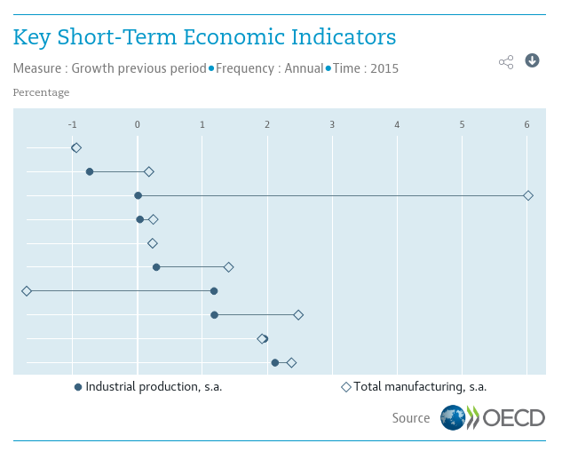

```{r setup, echo=FALSE, message=FALSE}
## devtools::build("..", vignettes = FALSE)
## devtools::document("..")
## devtools::install("..")
## library(rmarkdown)
library(rcw)
## library(rjson)
library(magrittr)
rcwopts <-
  list(
    inline = TRUE,
    save = TRUE
  )
## jsonFile <- "../data/rcw.json"
## jsonFile <- system.file("data/rcw.json", package = "rcw")
## rcwDataJson <- rjson::fromJSON(file = jsonFile)
## dput(sapply(rcwDataJson[[1]]$datapoints, "[[", 1))
## dput(sapply(rcwDataJson[[1]]$datapoints, "[[", 2))
## dput(sapply(rcwDataJson[[1]]$datapoints, "[[", 3))
```

- [codepen mock example](https://codepen.io/bowerth/pen/EXrdpP)


## Data

```{r data, echo=TRUE, results='as.is'}
rcwData <- data.frame(
    ## x = c(1000, 1001, 1010, 1011, 1100, 1101, 1110, 1111),
    x = c(2008, 2009, 2010, 2011, 2012, 2013, 2014, 2015),
    y = c(15, -20, 10, 40, 30, 25, 65, 27),
    highlightIndex = c(-1, -1, 0, -1, -1, -1, 1, -1))
knitr::kable(rcwData)
```


## Bar Chart

```{r bar-chart, eval=FALSE}
rcwChart(rcwData, type = "bar")
```


## Scatter Chart

```{r scatter-chart, eval=FALSE}
rcwChart(rcwData, type = "scatter")
```


## Row Chart

```{r row-chart, eval=FALSE}
rcwChart(rcwData, type = "row")
```


## Objective

```{r screenshot-1, out.width="100%", echo=FALSE, eval=FALSE}

```

## SAVE


```{r bar-chart-save, eval=TRUE, echo=FALSE}
wBar <- rcwChart(rcwData, type = "bar")
if (rcwopts$save) {
  htmlwidgets::saveWidget(wBar,
                          ## file = file.path(getwd(), "htmlwidget/rcw-bar.html"),
                          file = "./rcw-bar.html",
                          selfcontained = FALSE)
}
## if (rcwopts$inline) wBar
## if (rcwopts$inline)
htmltools::includeHTML("./rcw-bar.html")
```

```{r scatter-chart-save, eval=FALSE, echo=FALSE}
wScatter <- rcwChart(rcwData, type = "scatter")
if (rcwopts$save) {
  htmlwidgets::saveWidget(wScatter,
                          file = file.path(getwd(), "htmlwidget/rcw-scatter.html"),
                          selfcontained = FALSE)
}
if (rcwopts$inline) wScatter
```

```{r row-chart-save, eval=FALSE, echo=FALSE}
wRow <- rcwChart(rcwData, type = "row")
if (rcwopts$save) {
  htmlwidgets::saveWidget(wRow,
                          file = file.path(getwd(), "htmlwidget/rcw-row.html"),
                          selfcontained = FALSE)
}
if (rcwopts$inline) wRow
```
